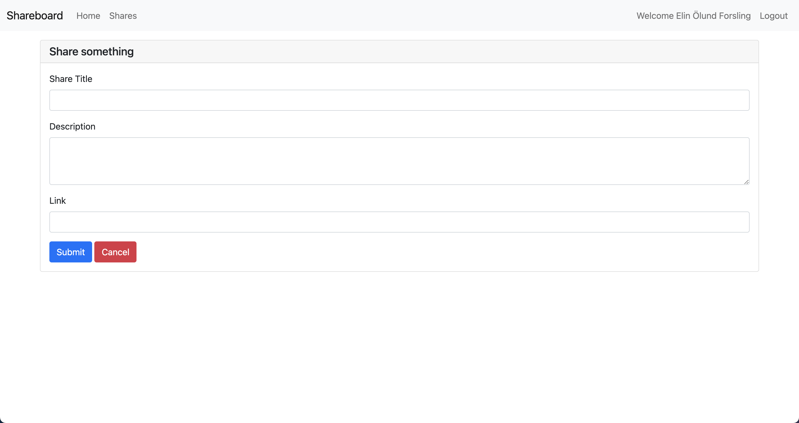

 

  <h3 align="center">Shareboard</h3>
  

    A basic link shareboard made in php and bootstrap. It was made with MAMP Pro, using phpMyAdmin in the background, and has user authentication, and basic CRUD functionality. A quick one-day project to get the good old php gears running again.
  

  
  

